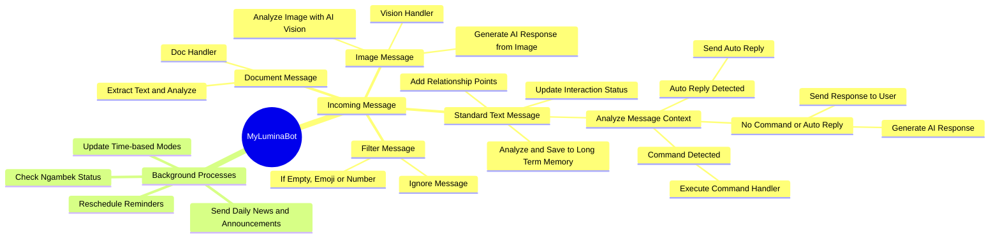

# 🌸 MyLumina v1 (Optimized) – Productive Assistant
> Telegram ChatBot smart, and act as your assistant.
> Built with love, by @rafardhancuy
> MIT License | Bahasa Indonesia 🇮🇩 | Full Offline-Compatible

## 🔥 Main Features
* **AI ChatBot with Groq (LLaMA, deepseek, etc)**: _Experience incredibly fast and intelligent conversational AI powered by the Groq API, providing natural and relevant replies to your queries using various state-of-the-art models._

* **Weather Info & Personalized Weather Reminders**: _Get current weather conditions and set custom reminders for specific weather events or forecasts in your area._

* **Automatic Prayer Schedule (Asia/Jakarta)**: _Stay updated with accurate prayer times for the Asia/Jakarta timezone._

* **Sad Song Recommendations at Night**: _A thoughtful touch – Lumina will recommend calming or sad songs nightly at 10 PM._

* **Dynamic Mood System (with rate limit and mood reset)**: _Lumina possesses a dynamic mood system that changes based on time, interaction, and context, making interactions more lifelike, with built-in rate limiting and mood reset functionalities._

* **Auto Cache Cleanup & Memory Flush**: _Ensures optimal performance by automatically managing and clearing cached data and memory._

* **Personal Notes & Reminders**: _Easily store personal notes and set timely reminders for your important tasks and events._

* **Web Search with AI Summarizer**: _Get concise summaries of web search results, leveraging AI to extract key information quickly using Google Custom Search._

* **DeepTalk Mode (Deeptalk/calm conversation)**: _Lumina intelligently shifts into a more profound and thoughtful "DeepTalk" mode after 9 PM for more meaningful and calming conversations._

* **Relationship System with Lumina**: _Develop a unique relationship with Lumina through continuous interaction, influencing her responses and personality over time._

* **Context Topic Auto Detection**: _Lumina can automatically detect the topic of your conversations, providing more contextually aware responses._

* **Holiday Info & Reminder**: _Stay informed about public holidays and receive reminders for upcoming celebrations._

* **Long-term Memory with Auto Detection**: _Lumina learns from your past conversations and preferences, building a long-term memory that influences future interactions._

* **Voice Notes Reminders**: _Set reminders using voice notes, making it convenient to capture thoughts on the go._

* **News Information & Summary (Everyday at 8 AM)**: _Receive daily news updates and summaries every morning at 8 AM._

* **AI Vision (Image Recognition with OCR)**: _Lumina can "see" and understand images, providing descriptions and performing Optical Character Recognition (OCR) to extract text from images._

* **Document Reader**: _Supported extensions include: TXT, PDF, DOCX/WORD, CSV, and Markdown. Lumina can read and summarize from these document types._

* **Dotenv Security**: _Securely manage your API keys and sensitive information using environment variables._

* **Pino for Structured Logging**: _Utilizes Pino for efficient and structured logging, making it easier to monitor and debug the bot's operations._

* **Sentry Integration for Error Trace**: _Integrated with Sentry for robust error tracking and detailed error traces, ensuring quick identification and resolution of issues._

---

## 📁 Project Structure

Here is an explanation of the main folder and file structure in the MyLumina project.

```
.
├── MyLumina/
├── assets/
│   └── voice/
│       └── (.ogg file)
├── config/
│   └── config.js
├── core/
│   ├── endpoints/
│   │   ├── coreTA.js
│   │   └── coreRouter.js
│   ├── core.js
│   └── ai-response.js
├── data/
│   └── memory.js
├── handler/
│   ├── commandHandler.js
│   ├── contextHandler.js 
│   ├── docHandler.js 
│   ├── holidayHandlers.js 
│   ├── relationHandler.js 
│   └── visionHandler  
├── modules/
│   ├── chatSummarizer.js 
│   ├── commandLists.js 
│   ├── documentReader.js 
│   ├── loveStateManager.js 
│   ├── ltmProcessor.js 
│   ├── mood.js 
│   ├── newsManager.js 
│   ├── ttsManager 
│   └── weather.js 
├── scheduler/  
│   ├── cronSetup.js 
│   └── updateTimeModes.js
├── state/
│   └── globalState.js
├── /utils/
│   ├── cacheHelper.js 
│   ├── chatFormatter.js 
│   ├── logger.js 
│   ├── sendMessage.js 
│   ├── songNotifier.js 
│   ├── telegramHelper 
│   └── timeHelper.js    
├── .env 
├── .gitignore 
├── index.js 
├── LICENSE
├── package-lock.json
├── package.json
└── README.md    
```

- **`./` (Root)**
- `index.js`: The main entry point for running the bot application.
- `.env`: Stores all API keys, bot tokens, and other sensitive environment variables.

- **`/assets`**: Stores static assets.
- `/voice`: Contains audio files (such as `.ogg`) used by `ttsManager` to send voice reminders or other notifications.

- **`/config`**: Contains configuration files.

- `config.js`: Bridge for loading and providing variables from `.env` files to the rest of the application.

- **`/core`**: Core directory that is the heart of the bot logic.
- `core.js`: The bot's main orchestrator. This file handles incoming messages, routes them to the appropriate *handlers* (document, image, text), manages the bot's internal state (such as *sulky* mode), and initializes all components.
- `ai-response.js`: Responsible for constructing *prompts* and generating responses from the AI ​​model (Groq), taking into account context, mood, and other data.
- `/endpoints`: Contains specific implementations for interacting with various AI API providers (e.g., TogetherAI, OpenRouter).

- **`/data`**: Manages data persistence.
- `memory.js`: Module for short-term and long-term memory management using LokiJS. Stores chat history, user preferences, and other state.

- **`/handler`**: Contains modules that handle specific types of input or logic.
- `commandHandler.js`: Handles text-based commands (e.g., `/help`, `/status`) and regex pattern-based auto-replies.
- `contextHandler.js`: Analyzes incoming messages to detect the topic or context of the conversation.
- `docHandler.js`: Processes document files sent by users.
- `relationHandler.js`: Manages the relationship and affection system between the bot and the user.
- `visionHandler.js`: Handles requests involving image analysis (AI Vision).

- **`/modules`**: Functional components that provide specific features for the bot.
- `ltmProcessor.js`: Performs automatic detection of text messages to save user preferences to long-term memory (LTM).
- `mood.js`: Contains the definition of the *mood* objects and states that the bot can have (e.g., Happy, Sad, Jealous).
- `ttsManager.js`: Manages Text-to-Speech (TTS) functionality, mainly for scheduling reminders.
- *Other modules such as `weather.js`, `newsManager.js`, `loveStateManager.js`, etc.*

- **`/scheduler`**: Handles scheduled tasks.
- `cronSetup.js`: Sets up and initializes all *cron jobs* for background tasks (e.g., check status, send daily reminders).
- `updateTimeModes.js`: Module for updating the bot's state or *mood* based on time (e.g., say good morning, change personality at night).

- **`/state`**: Manages the global state of the application.

- `globalState.js`: Stores global state variables that can be accessed across modules, such as *sulky* status, last interaction timestamp, etc.

- **`/utils`**: A collection of helper functions (utilities) used in various parts of the application.
- `logger.js`: Structured logging utilities using Pino.
- `sendMessage.js`: Centralized function for sending messages back to the user via the Telegram API.
- `timeHelper.js`: Helper functions for handling time zones (Asia/Jakarta).
- `cacheHelper.js`, `chatFormatter.js`, `telegramHelper.js`, etc.

---

## Bot Workflow (Mind Map)

The following diagram explains the message processing flow from start to finish inside MyLumina.



---


## 🚀 Getting Started
### Prerequisites
* **Node.js (>= 18)**

* **Telegram Bot Token from [@BotFather](https://t.me/BotFather)**

* **Groq API Key from [Groq](https://groq.com)**

* **OpenWeatherMap API Key from [OpenWeatherMap](https://openweathermap.org)**

* **Google Custom Search API Key & CSE ID**

* **Your Telegram Chat ID**: for scheduled messages

## Installation
### Follow these steps to get your Lumina bot up and running:

#### 1. **Clone the repository**:
```bash
git clone https://github.com/Rafacuy/MyLumina
cd MyLumina
```

#### 2. **Install dependencies**:
```bash
npm install
```

#### 3. **Configure dotenv**: _Create a .env file in the root directory._
Example:
```bash
TELEGRAM_BOT_TOKEN=YOUR_TELEGRAM_TOKEN             # Replace it with your actual Telegram Bot Token
GROQ_API_KEY=YOUR_GROQ_API_KEY                     # Change to your Groq API Key
WEATHER_API_KEY=YOUR_OPENWEATHERMAP_KEY            # Replace it with your actual OpenWeather API Key
PORT=30000                                         # The port on which the bot's server will run.
LATITUDE=-6.200000                                 # Change it to your location's LATITUDE (e.g., Jakarta)
LONGITUDE=106.816666                               # Change it to your location's LONGITUDE (e.g., Jakarta)
NEWSAPI=YOUR_NEWSAPI_KEY                           # Change it to your actual NewsAPI key
TARGET_CHAT_ID=YOUR_CHAT_ID                        # Your Telegram Chat ID for scheduled messages
CALENDARIFIC_API_KEY=YOUR_CALENDARIFIC_API_KEY     # Change it to your actual Calendarific API KEY
GOOGLE_SEARCH_API_KEY=YOUR_GOOGLE_SEARCH_API_KEY   # Your Google Search API Key
GOOGLE_SEARCH_CX=YOUR_GOOGLE_SEARCH_CX             # Your Google Custom Search Engine ID
OCR_API_KEY=YOUR_OCR_API_KEY                       # Your API Key for ocr.space
IMAGGA_API_KEY=YOUR_IMAGGA_API_KEY                 # Your Imagga API Key
IMAGGA_API_SECRET=YOUR_IMAGGA_API_SECRET           # Your Imagga API Secret
DSN_KEY=YOUR_DSN_KEY                               # Your DSN Key for Sentry
```

* `TELEGRAM_BOT_TOKEN`: Your Telegram Bot API token from BotFather.

* `GROQ_API_KEY`: Your Groq API Key from [groq](https://groq.com).

* `TARGET_CHAT_ID`: The chat ID where Lumina will send scheduled messages like prayer times and weather updates.

* `WEATHER_API_KEY`: Your API key from [OpenWeatherMap](https://openweathermap.org).

* `LATITUDE` and `LONGITUDE`: The geographic coordinates for which you want weather updates (e.g., for Jakarta: LATITUDE=-6.200000, LONGITUDE=106.816666).

* `NEWSAPI`: Your API key from [NewsAPI](https://newsapi.org).

* `CALENDARIFIC_API_KEY`: Your API Key from [Calendarific](https://calendarific.com).

* `GOOGLE_SEARCH_API_KEY`: Your API Key from [Google Custom Search](https://developers.google.com/custom-search/v1/overview).

* `GOOGLE_SEARCH_CX`: Your Custom Search Engine ID from [Google Custom Search Engine](https://developers.google.com/custom-search/v1/overview).

* `OCR_API_KEY`: Your API Key from [ocr.space](https://ocr.space).

* `IMAGGA_API_KEY`: Your API Key for [Imagga](https://imagga.com).

* `IMAGGA_API_SECRET`: Your API Secret for [Imagga](https://imagga.com).

* `DSN_KEY`: Your DSN (Data Source Name) Key for Sentry error monitoring.

#### 4. **Customize Lumina (Optional)**:

* Adjust `MOOD_TIMEOUT_MS` to change how long Lumina's mood lasts before resetting to 'NORMAL' (default: 2 days).

* Modify `SLEEP_START_HOUR` and `SLEEP_END_HOUR` to set Lumina's sleep schedule (default: 00:00 - 04:00).

* `RATE_LIMIT_WINDOW_MS` and `RATE_LIMIT_MAX_REQUESTS` control the rate limiting behavior.

* `CONVERSATION_HISTORY_LIMIT` defines how many recent messages are sent to the AI for context (default: 3).

* You can add preferences for Lumina's Long-Term Memory (LTM).

* You can modify the Text-to-Speech (TTS) voices in the [assets](assets/voice) directory.

---

## Usage
Once the bot is running, you can interact with Lumina in your Telegram chat.

### To start the Lumina bot
```bash
npm start
```

### **General Chat**: Send any message to Lumina, and she will respond based on her AI model, personality, and current mood.

### **Predefined Commands**: Lumina has specific responses for certain phrases and commands:

* `hai, halo, bot, helo, haii, woy, hoy`: Lumina will greet you happily.

* `terima kasih, makasih`: Lumina will express happiness to have helped.

* `siapa kamu, kamu siapa`: Lumina will introduce herself.

* `lagi apa, lagi ngapain, ngapain`: Lumina will give a loving response about thinking of you.

* `/reminder HH:MM (Message)`: Set a reminder for a specific time.

* `/note pesan`: Save a personal note.

* `/shownotes`: Display all your saved personal notes.

* `/search query`: Search for information on Google and get a summarized result.

* `/help`: Show a list of available commands.

* `/hariini`: Get today's information (holidays, news summary, etc.).

* `/author`: Information about the creator of Lumina.

### **Scheduled Messages**: If `TARGET_CHAT_ID` is configured, Lumina will automatically send:

* Daily prayer time reminders for Subuh, Dzuhur, Ashar, Maghrib, and Isya (Asia/Jakarta timezone).

* Periodic weather updates and personalized weather-based reminders (every 5 hours).

* Sad song recommendations every 10 PM.

* Morning News Information & Summary every 8 AM.

* Voice Notes everyday (Morning, Afternoon, tonight and Prayers time).

## Deployment
### Server
To deploy Lumina on a live system, you would typically use a process manager like PM2 to keep the Node.js application running continuously.

* **Live**: For a production environment, ensure the bot is running with PM2 or a similar solution to handle restarts and logging.

* **Development**: Run directly via `node index.js`.

## 🙏 Thank you
* **For those** of you who have strayed into this repo.

* **For those** of you who have ever felt lonely at night.

* **Lumina** is ready to be your virtual conversation partner. 🌙💖

## 👤 About the Author
**Arash**

* TikTok: @rafardhancuy

* GitHub: Rafacuy

* Language: Indonesian

* Time Zone: Asia/Jakarta

* License: MIT

## 📜 License
**This project is licensed under the MIT License. Please see LICENSE for details.**